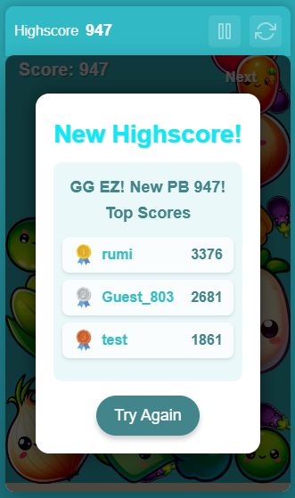

# Potato Game: A Physics-Based Vegetable Stacking Game

Potato Game is a modern, physics-based game inspired by Suika Game where players stack vegetables of the same type to merge them into larger ones and earn points. With features like **leaderboards**, **physics-based interactions**, and **Twitch integration**, Potato Game provides a fun and engaging gaming experience.

## Features
- **Physics Engine**: Realistic vegetable collisions and interactions using Matter.js.
- **Unique Vegetable Shapes**: Various vegetables with distinct physical properties and behaviors.
- **Leaderboard System**: Track and compete for high scores with other players.
- **Dual Deployment Options**: Web version with username login and Twitch panel extension.
- **Responsive Design**: Works seamlessly on desktop, tablet, and mobile devices.
- **Real-Time Updates**: Scores update instantly without page refreshes.
- **Pause & Restart**: Control your game session with pause functionality and quick restarts.

## Technologies Used
- **Frontend**: HTML5, CSS3, JavaScript, Matter.js
- **Backend**: Firebase for database and user authentication
- **Build Tools**: Webpack, Babel
- **Integration**: Twitch Extensions SDK
- **Deployment**: Web hosting and Twitch Developer Console

## Live Demo
Check out the live demo of Potato Game:  
[Potato Game Live Demo](http://147.93.94.250/potatogame/)

## Screenshots
### Game Screen

### Leaderboard


## Installation
To run Potato Game locally, follow these steps:

### Prerequisites
- Node.js (v16 or higher)
- NPM or Yarn package manager
- Firebase account (for database and authentication)

### Firebase Setup (Required)
1. Create a Firebase account at [Firebase Console](https://console.firebase.google.com/)
2. Create a new project
3. Set up Firestore Database
   - Go to Firestore Database and click "Create database"
   - Choose "Start in production mode" and select a location
4. Get your Firebase config:
   - Go to Project Settings > General > Your apps
   - Click the web icon (</>) to add a web app
   - Register your app with a nickname
   - Copy the Firebase configuration object
5. Replace the Firebase configuration in `game.js` with your own:
   ```javascript
   const firebaseConfig = {
     apiKey: "YOUR_API_KEY",
     authDomain: "YOUR_PROJECT_ID.firebaseapp.com",
     databaseURL: "https://YOUR_PROJECT_ID.firebaseio.com",
     projectId: "YOUR_PROJECT_ID",
     storageBucket: "YOUR_PROJECT_ID.appspot.com",
     messagingSenderId: "YOUR_MESSAGING_SENDER_ID",
     appId: "YOUR_APP_ID"
   };
   ```
   
### Setup
1. Clone the repository:
```bash
git clone https://github.com/TheShizuka/PotatoGame
cd potato-game
```

2. Install dependencies:
```bash
npm install
```

3. Start the development server:
```bash
npm run dev
```

4. Build for production:
```bash
npm run build
```

The game will be available at `http://localhost:8080` or by opening the `public/index.html` file in your browser.

## Twitch Extension Deployment

1. Build the project:
```bash
npm run build
```

2. Create a ZIP file containing:
   - `public/bundle.js`
   - `public/index.html`
   - `public/matter.js`
   - `public/assets/` folder

3. Upload the ZIP to your Twitch Developer Console.

## Contact
If you have any questions or feedback, feel free to reach out:
- Email: ayatgimenez@hotmail.com
- LinkedIn: [Hicham AYAT GIMENEZ](https://www.linkedin.com/in/hicham-a-9553ba28b/)
- Portfolio: [Portfolio Website](https://shizukadesu.com/)

Made with ❤️ for the Twitch community